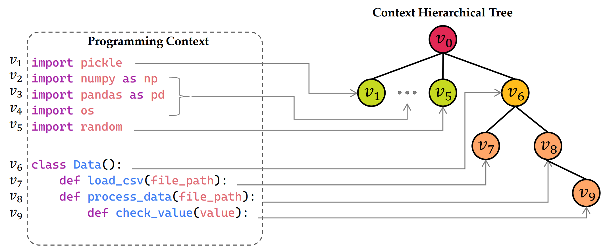

#### Enhancing Code Search Intent with Programming Context Exploration

This is the code and dataset for paper *Enhancing Code Search Intent with Programming Context Exploration*.

We provide the code for ConCR-GraphCodeBERT, and for other backbones, only need to replace all the encoders. In this repository, we provide 300 examples from the CodeSearchNet-C dataset for both Java and Python. The complete dataset link is provided [here](https://pan.baidu.com/s/1GyK3SdPd84IzzbpRoW-Qqg?pwd=rc1t).

Run the code with command

```bash
sh run.sh
```
Detailed running arguments are available in `run.sh`.

- Requirements:
    - torch
    - transformers
    - numpy

- File list:
    `readme.md` This readme file
    `run.sh` Code execution script
    `sample.py` Codes for the context walking algorithm
    `run.py` Running entry, including argument parsing and code running
    `model.py` Codes for ConCR-GraphCodeBERT model
    `CodeSearchNet-C`
    |—`java` Java Language dateset
    |    |—`example_train.json` Train data file
    |    |—`example_valid.josn` Valid data file
    |    |—`example_test.json` Test data file
    |    |—`example_codebase.json` codebase data file
    |—`python` Python Language dataset
    |    |—`example_train.json` Train data file
    |    |—`example_valid.josn` Valid data file
    |    |—`example_test.json` Test data file
    |    |—`example_codebase.json` codebase data file
    
- Context dataset description

    Field `context`: Namely the programming context

    Field `function`: Namely function/class statement

    Field `package`: Namely import statement

    Field `levels`: Used for constructing CHT data structure. For example, as shown in the figure below, the root node is located at layer 0,  the level is defined as -1. Nodes v1-v6 are located at layer 1, the level is defined as 0. Nodes v7 and v8 are located at layer 2,  the level is defined as 1, and so on.

    


If this code has been helpful to you, please cite our paper using the following format:

```
@inproceedings{dong2025concr,
  title={Enhancing Code Search Intent with Programming Context Exploration},
  author={Yanmin, Dong and Zhenya, Huang and Zheng, Zhang and Guanhao, Zhao and Likang, Wu and Hongke, Zhao and Binbin, Jin and Qi, Liu},
  booktitle={The 18th ACM International Conference on Web Search and Data Mining},
  year={2025}
}
```

